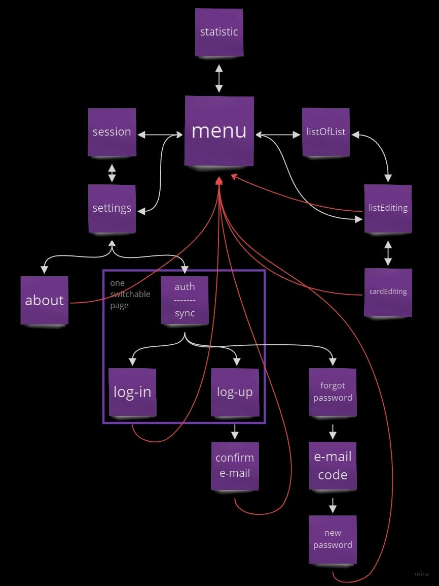

# Web-Word-Cards

## Brief:

Web App for creating groups of flashcards with foreign words and repeating them regularly  
based on the spaced repetition system.

## app navigation scheme

## data management in 3 steps ;)

1. Data taken from a localStorage when the page is opened,  
   further get Data from the server // if(Server != localStorage)

2. Further interaction with Data occurs only with state and localStorage.

3. Fresh Data sending in moment page refresh or close.

P.s. later is will need synchronization,  
I'm thinking of implementing this on websockets
